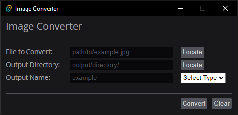

# Image Converter

A lightweight desktop application made using [Tauri](https://tauri.app/). Convert a multitude of image formats with an easy-to-use GUI!

## Supported Formats

-   AVIF
-   BMP
-   ICO
-   JPG
-   PNG
-   QOI
-   TIFF
-   TGA
-   WEBP

## Installation

You must have Rust and Cargo installed. Download both [here](https://www.rust-lang.org/tools/install).

1.  Download the source code
    -   run the command: `git clone https://github.com/Brooklyn-Dev/image-converter.git`
2.  Use `cargo build --release` to compile image-converter
3.  Navigate to the project directory `cd image-converter`
4.  Find the compiled executable `image-converter.exe` in the `target\release\` directory
5.  Move the executable to a directory in your system's PATH
    -   **Windows**: `C:\Windows\System32`
    -   **Linux**: `\usr\bin`

## Dependencies

-   [tauri](https://github.com/tauri-apps/tauri) - Framework for building cross-platform native desktop applications
-   [image](https://github.com/image-rs/image) - Image processing, conversion and saving
-   [rfd](https://github.com/PolyMeilex/rfd) - Cross-platform file dialog

## Like this project?

If you find this project interesting or useful, consider giving it a star ⭐️!
